# Evently - High-Level Architecture Diagram

This document provides a comprehensive view of the Evently platform's system architecture, showing the main components, data flow, and integration patterns.

## System Overview

Evently implements a **multi-layered, event-driven architecture** designed for high concurrency, scalability, and reliability. The system handles thousands of concurrent booking requests while preventing overselling through atomic database operations and comprehensive caching strategies.

## High-Level Architecture Diagram

```mermaid
graph TB
    %% External Actors
    User[👤 Users<br/>Web/Mobile Clients]
    Admin[👨‍💼 Administrators<br/>Management Interface]
    
    %% Load Balancing Layer
    LB[🌐 Load Balancer<br/>nginx/ALB/HAProxy]
    
    %% Application Layer
    subgraph "Application Tier"
        API1[🚀 Evently API Instance 1<br/>Spring Boot 3.5.5]
        API2[🚀 Evently API Instance 2<br/>Spring Boot 3.5.5]
        API3[🚀 Evently API Instance N<br/>Spring Boot 3.5.5]
    end
    
    %% Data Layer
    subgraph "Data Persistence Layer"
        PG_PRIMARY[(🗄️ PostgreSQL Primary<br/>Events, Bookings, Users)]
        PG_REPLICA[(📖 PostgreSQL Read Replica<br/>Analytics Queries)]
    end
    
    %% Caching Layer
    subgraph "Caching & Session Layer"
        REDIS_CLUSTER[📦 Redis Cluster<br/>Cache + Distributed Locks]
        REDIS_CACHE[⚡ Redis Cache<br/>Event Lists, User Sessions]
        REDIS_LOCKS[🔒 Redis Locks<br/>Concurrency Control]
    end
    
    %% Message Processing Layer
    subgraph "Event Streaming Platform"
        KAFKA[📨 Apache Kafka KRaft<br/>Event Streaming]
        TOPIC1[📋 booking-cancelled<br/>Topic]
        TOPIC2[⏳ waitlist-notification<br/>Topic]
        TOPIC3[📊 analytics-events<br/>Topic]
    end
    
    %% External Services
    subgraph "External Services"
        MAILHOG[📧 MailHog/SMTP<br/>Email Notifications]
        WEBSOCKET[🔄 WebSocket<br/>Real-time Notifications]
        MONITORING[📊 Monitoring<br/>Prometheus + Grafana]
    end
    
    %% API Gateway/Documentation
    subgraph "API Documentation"
        SWAGGER[📚 Swagger UI<br/>API Documentation]
        ACTUATOR[🔍 Spring Actuator<br/>Health Checks & Metrics]
    end
    
    %% Connection Flow
    User --> LB
    Admin --> LB
    LB --> API1
    LB --> API2  
    LB --> API3
    
    %% Data Connections
    API1 --> PG_PRIMARY
    API2 --> PG_PRIMARY
    API3 --> PG_PRIMARY
    
    API1 -.-> PG_REPLICA
    API2 -.-> PG_REPLICA
    API3 -.-> PG_REPLICA
    
    %% Cache Connections
    API1 --> REDIS_CLUSTER
    API2 --> REDIS_CLUSTER
    API3 --> REDIS_CLUSTER
    
    REDIS_CLUSTER --> REDIS_CACHE
    REDIS_CLUSTER --> REDIS_LOCKS
    
    %% Message Flow
    API1 --> KAFKA
    API2 --> KAFKA
    API3 --> KAFKA
    
    KAFKA --> TOPIC1
    KAFKA --> TOPIC2
    KAFKA --> TOPIC3
    
    %% External Service Connections
    API1 --> MAILHOG
    API2 --> MAILHOG
    API3 --> MAILHOG
    
    API1 --> WEBSOCKET
    API2 --> WEBSOCKET
    API3 --> WEBSOCKET
    
    %% Monitoring Connections
    API1 --> MONITORING
    API2 --> MONITORING
    API3 --> MONITORING
    
    ACTUATOR --> MONITORING
    
    %% Documentation Access
    User -.-> SWAGGER
    Admin -.-> SWAGGER
    Admin -.-> ACTUATOR
    
    %% Styling
    classDef userClass fill:#e1f5fe,stroke:#01579b,stroke-width:2px
    classDef appClass fill:#f3e5f5,stroke:#4a148c,stroke-width:2px
    classDef dataClass fill:#e8f5e8,stroke:#1b5e20,stroke-width:2px
    classDef cacheClass fill:#fff3e0,stroke:#e65100,stroke-width:2px
    classDef messageClass fill:#fce4ec,stroke:#880e4f,stroke-width:2px
    classDef externalClass fill:#f1f8e9,stroke:#33691e,stroke-width:2px
    
    class User,Admin userClass
    class API1,API2,API3 appClass
    class PG_PRIMARY,PG_REPLICA dataClass
    class REDIS_CLUSTER,REDIS_CACHE,REDIS_LOCKS cacheClass
    class KAFKA,TOPIC1,TOPIC2,TOPIC3 messageClass
    class MAILHOG,WEBSOCKET,MONITORING,SWAGGER,ACTUATOR externalClass
```

## Detailed Component Breakdown

### 1. **Client Layer**

#### **User Clients**
- **Web Applications**: React/Vue.js SPAs calling REST APIs
- **Mobile Applications**: Native iOS/Android or React Native
- **Third-party Integrations**: External systems using API keys

#### **Admin Interfaces**
- **Management Dashboard**: Admin web interface for event management
- **Analytics Portal**: Business intelligence and reporting tools
- **Monitoring Dashboards**: System health and performance monitoring

### 2. **Application Tier (Stateless)**

#### **Spring Boot API Instances**

```mermaid
graph LR
    subgraph "Single API Instance Internals"
        CONTROLLER[🎮 Controllers<br/>REST Endpoints]
        SERVICE[⚙️ Services<br/>Business Logic]
        REPOSITORY[📊 Repositories<br/>Data Access]
        CACHE_MANAGER[💾 Cache Manager<br/>Redis Integration]
        EVENT_PUBLISHER[📤 Event Publisher<br/>Kafka Producer]
        EVENT_CONSUMER[📥 Event Consumer<br/>Kafka Consumer]
    end
    
    CONTROLLER --> SERVICE
    SERVICE --> REPOSITORY
    SERVICE --> CACHE_MANAGER
    SERVICE --> EVENT_PUBLISHER
    EVENT_CONSUMER --> SERVICE
```

**Key Features:**
- **Stateless Design**: No server-side session storage
- **Horizontal Scaling**: Multiple instances behind load balancer
- **Circuit Breakers**: Resilience patterns for external service calls
- **Health Checks**: Comprehensive health endpoints for monitoring

### 3. **Data Persistence Layer**

#### **PostgreSQL Configuration**

```mermaid
graph TB
    subgraph "Database Cluster"
        MASTER[(🗄️ PostgreSQL Primary<br/>Read/Write Operations)]
        REPLICA1[(📖 Read Replica 1<br/>Analytics Queries)]
        REPLICA2[(📖 Read Replica 2<br/>Reporting Queries)]
    end
    
    MASTER -.->|Streaming Replication| REPLICA1
    MASTER -.->|Streaming Replication| REPLICA2
    
    subgraph "Database Features"
        MIGRATIONS[📋 Flyway Migrations<br/>Schema Evolution]
        INDEXES[🔍 Optimized Indexes<br/>High-Concurrency Queries]
        CONSTRAINTS[🔒 Data Integrity<br/>Foreign Key Constraints]
        PARTITIONING[📊 Table Partitioning<br/>Large Dataset Management]
    end
```

**Database Optimization Features:**
- **Connection Pooling**: HikariCP with 50+ concurrent connections
- **Query Optimization**: Strategic indexing for booking operations
- **Atomic Operations**: Database-level concurrency protection
- **Read Replicas**: Separate analytics queries from transactional load

### 4. **Caching & Session Management**

#### **Redis Architecture**

```mermaid
graph TB
    subgraph "Redis Cluster Setup"
        REDIS_MASTER[📦 Redis Master<br/>Primary Cache Operations]
        REDIS_SLAVE1[📦 Redis Slave 1<br/>Read Operations]
        REDIS_SLAVE2[📦 Redis Slave 2<br/>Read Operations]
    end
    
    REDIS_MASTER -.->|Replication| REDIS_SLAVE1
    REDIS_MASTER -.->|Replication| REDIS_SLAVE2
    
    subgraph "Cache Categories"
        EVENT_CACHE[⚡ Event Cache<br/>5min TTL]
        USER_CACHE[👤 User Sessions<br/>30min TTL]
        ANALYTICS_CACHE[📊 Analytics Cache<br/>1hour TTL]
        LOCKS[🔒 Distributed Locks<br/>Concurrency Control]
    end
    
    REDIS_MASTER --> EVENT_CACHE
    REDIS_MASTER --> USER_CACHE
    REDIS_MASTER --> ANALYTICS_CACHE
    REDIS_MASTER --> LOCKS
```

**Caching Strategy:**
- **Cache-Aside Pattern**: Application-managed cache updates
- **TTL Management**: Different expiration policies per data type
- **Cache Invalidation**: Smart invalidation on data updates
- **Distributed Locking**: Redis-based locks for critical sections

### 5. **Event Streaming Platform**

#### **Kafka Message Flow**

```mermaid
graph TB
    subgraph "Kafka Cluster"
        BROKER1[📨 Kafka Broker 1]
        BROKER2[📨 Kafka Broker 2]
        BROKER3[📨 Kafka Broker 3]
    end
    
    subgraph "Topics & Partitions"
        TOPIC_BOOKING[booking-cancelled<br/>Partitions: 3<br/>Replication: 2]
        TOPIC_WAITLIST[waitlist-notification<br/>Partitions: 3<br/>Replication: 2]
        TOPIC_ANALYTICS[analytics-events<br/>Partitions: 6<br/>Replication: 2]
    end
    
    subgraph "Consumer Groups"
        CG_NOTIFICATION[📧 Notification Service<br/>Consumer Group]
        CG_ANALYTICS[📊 Analytics Service<br/>Consumer Group]
        CG_WAITLIST[⏳ Waitlist Processor<br/>Consumer Group]
    end
    
    BROKER1 --> TOPIC_BOOKING
    BROKER2 --> TOPIC_WAITLIST
    BROKER3 --> TOPIC_ANALYTICS
    
    TOPIC_BOOKING --> CG_NOTIFICATION
    TOPIC_WAITLIST --> CG_WAITLIST
    TOPIC_ANALYTICS --> CG_ANALYTICS
```

**Event Processing Features:**
- **Guaranteed Delivery**: At-least-once delivery semantics
- **Partitioned Processing**: Parallel processing across partitions
- **Consumer Groups**: Fault-tolerant message processing
- **Dead Letter Topics**: Failed message handling and retry logic

## Data Flow Patterns

### 1. **Booking Request Flow**

### 2. **Waitlist Processing Flow**

## Concurrency & Race Condition Handling

### Multi-Layered Protection Strategy

```mermaid
graph TB
    REQUEST[📥 Booking Request]
    
    subgraph "Layer 1: Application Level"
        IDEMPOTENCY[🔑 Idempotency Key Check<br/>Prevent Duplicate Requests]
        VALIDATION[✅ Request Validation<br/>Business Rule Checks]
    end
    
    subgraph "Layer 2: Database Level"
        ATOMIC_SQL[⚛️ Atomic SQL Operations<br/>UPDATE ... WHERE available >= quantity]
        OPTIMISTIC_LOCK[🔄 Optimistic Locking<br/>@Version Entity Management]
        TRANSACTION[🏦 Transaction Isolation<br/>READ_COMMITTED Level]
    end
    
    subgraph "Layer 3: Infrastructure Level"
        REDIS_LOCK[🔒 Distributed Locks<br/>Redis-based Locking]
        RETRY_MECHANISM[🔄 Retry with Backoff<br/>Exponential Backoff Strategy]
    end
    
    REQUEST --> IDEMPOTENCY
    IDEMPOTENCY --> VALIDATION
    VALIDATION --> ATOMIC_SQL
    ATOMIC_SQL --> OPTIMISTIC_LOCK
    OPTIMISTIC_LOCK --> TRANSACTION
    TRANSACTION --> REDIS_LOCK
    REDIS_LOCK --> RETRY_MECHANISM
```

## Scalability & Performance Considerations

### Horizontal Scaling Architecture

```mermaid
graph TB
    subgraph "Auto-Scaling Group"
        direction TB
        ALB[⚖️ Application Load Balancer<br/>Health Check Enabled]
        
        subgraph "API Instances (Auto-Scaled)"
            API1[🚀 API Instance 1<br/>2 CPU, 4GB RAM]
            API2[🚀 API Instance 2<br/>2 CPU, 4GB RAM]
            API3[🚀 API Instance 3<br/>2 CPU, 4GB RAM]
            APIN[🚀 API Instance N<br/>2 CPU, 4GB RAM]
        end
    end
    
    subgraph "Scaling Triggers"
        CPU_METRIC[📊 CPU > 70%<br/>Scale Out]
        MEMORY_METRIC[🧠 Memory > 80%<br/>Scale Out]
        REQUEST_METRIC[📈 Requests/sec > 1000<br/>Scale Out]
        RESPONSE_TIME[⏱️ Response Time > 500ms<br/>Scale Out]
    end
    
    ALB --> API1
    ALB --> API2
    ALB --> API3
    ALB --> APIN
    
    CPU_METRIC -.-> ALB
    MEMORY_METRIC -.-> ALB
    REQUEST_METRIC -.-> ALB
    RESPONSE_TIME -.-> ALB
```

### Performance Optimization Features

1. **Database Optimization**
   - Strategic indexing on high-query columns
   - Connection pooling with HikariCP
   - Read replicas for analytics queries
   - Query optimization and execution plan analysis

2. **Caching Strategy** 
   - Multi-level caching (L1: Application, L2: Redis)
   - Cache warming for popular events
   - Smart invalidation patterns
   - CDN integration for static assets

3. **Application Performance**
   - Stateless design for horizontal scaling
   - Async processing for non-critical operations
   - Batch processing for bulk operations
   - JVM tuning for garbage collection

## Production Deployment Architecture

### Container Orchestration Setup

```mermaid
graph TB
    subgraph "Production Environment"
        subgraph "Container Orchestration"
            K8S_CLUSTER[☸️ Kubernetes Cluster<br/>Container Orchestration]
            K8S_INGRESS[🌐 Ingress Controller<br/>SSL Termination]
            K8S_SERVICE[⚖️ Load Balancer Service<br/>Internal Load Balancing]
        end
        
        subgraph "Application Pods"
            POD1[🚀 Evently Pod 1<br/>API Instance]
            POD2[🚀 Evently Pod 2<br/>API Instance]
            POD3[🚀 Evently Pod 3<br/>API Instance]
        end
        
        subgraph "Data Layer"
            PG_CLUSTER[(🗄️ Managed PostgreSQL<br/>High Availability)]
            REDIS_MANAGED[📦 Managed Redis<br/>Cluster Mode]
            KAFKA_MANAGED[📨 Managed Kafka<br/>Multi-AZ Setup]
        end
        
        subgraph "Monitoring Stack"
            PROMETHEUS[📊 Prometheus<br/>Metrics Collection]
            GRAFANA[📈 Grafana<br/>Dashboards]
            JAEGER[🔍 Jaeger<br/>Distributed Tracing]
        end
    end
    
    K8S_INGRESS --> K8S_SERVICE
    K8S_SERVICE --> POD1
    K8S_SERVICE --> POD2
    K8S_SERVICE --> POD3
    
    POD1 --> PG_CLUSTER
    POD2 --> PG_CLUSTER
    POD3 --> PG_CLUSTER
    
    POD1 --> REDIS_MANAGED
    POD2 --> REDIS_MANAGED
    POD3 --> REDIS_MANAGED
    
    POD1 --> KAFKA_MANAGED
    POD2 --> KAFKA_MANAGED
    POD3 --> KAFKA_MANAGED
    
    POD1 --> PROMETHEUS
    POD2 --> PROMETHEUS
    POD3 --> PROMETHEUS
    
    PROMETHEUS --> GRAFANA
    PROMETHEUS --> JAEGER
```

## Technology Stack Summary

### **Core Technologies**
- **Runtime**: Java 21 LTS with Spring Boot 3.5.5
- **Framework**: Spring Data JPA, Spring Security, Spring Cloud Stream
- **Database**: PostgreSQL 15+ with HikariCP connection pooling
- **Caching**: Redis 7+ with Spring Data Redis and Redisson
- **Messaging**: Apache Kafka (KRaft mode) with Spring Cloud Stream

### **Supporting Technologies**
- **Build Tool**: Maven 3.8+ with multi-stage Docker builds
- **Testing**: JUnit 5, Testcontainers, Spring Boot Test
- **Documentation**: SpringDoc OpenAPI 3, Swagger UI
- **Monitoring**: Spring Actuator, Prometheus, Grafana
- **Deployment**: Docker, Kubernetes, or Platform-as-a-Service

### **Development Tools**
- **Database Migration**: Flyway for schema versioning
- **Code Generation**: MapStruct for entity-DTO mapping
- **Validation**: Bean Validation (JSR-303) annotations
- **Logging**: SLF4J with Logback and structured JSON output

This architecture provides a solid foundation for a production-ready event ticketing platform capable of handling high concurrency while maintaining data consistency and providing excellent user experience through comprehensive caching and real-time notifications.
