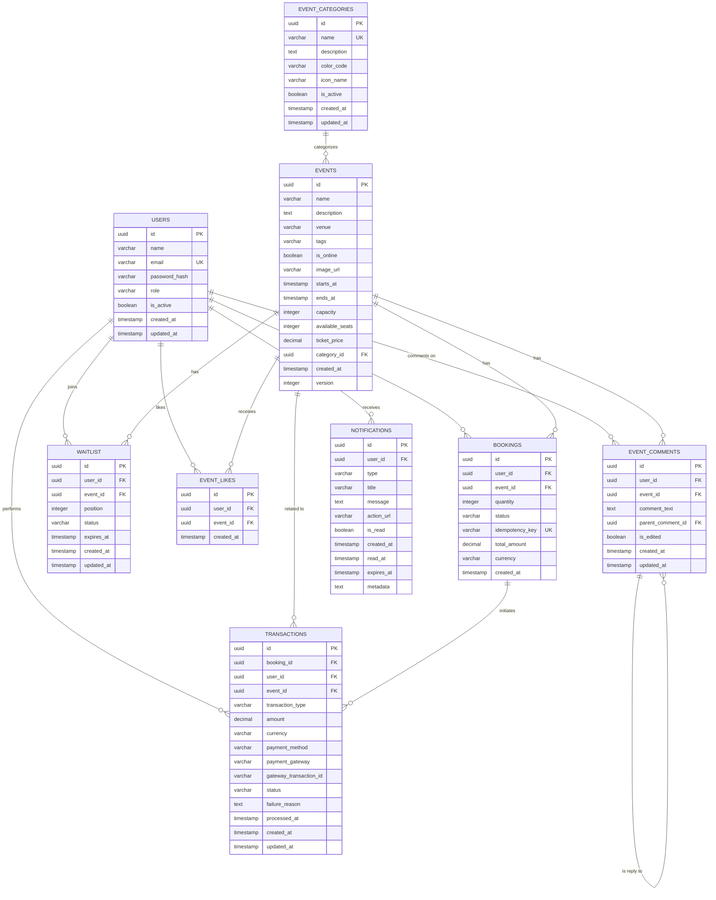

# Evently - Database Schema & Entity-Relationship Diagram

This document provides a comprehensive view of the Evently platform's database schema, showing entity relationships, constraints, and indexing strategies designed for high-concurrency event ticketing operations.

## Database Overview

The Evently database is designed using **PostgreSQL 15+** with a focus on:
- **ACID Compliance**: Ensuring data consistency during concurrent operations
- **Optimized Indexing**: Strategic indexes for high-performance queries
- **Referential Integrity**: Proper foreign key relationships and constraints
- **Scalability**: Partitioning and read replica support
- **Audit Trail**: Complete transaction and booking history

## Entity-Relationship Diagram



## Detailed Entity Descriptions

### 1. **Core Entities**

#### **USERS**
```sql
CREATE TABLE users (
    id UUID PRIMARY KEY DEFAULT gen_random_uuid(),
    name VARCHAR(100) NOT NULL,
    email VARCHAR(255) NOT NULL UNIQUE,
    password_hash VARCHAR(255) NOT NULL,
    role VARCHAR(20) DEFAULT 'USER' NOT NULL,
    is_active BOOLEAN DEFAULT TRUE NOT NULL,
    created_at TIMESTAMP WITH TIME ZONE DEFAULT NOW() NOT NULL,
    updated_at TIMESTAMP WITH TIME ZONE DEFAULT NOW() NOT NULL,
    
    CONSTRAINT chk_user_role CHECK (role IN ('USER', 'ADMIN')),
    CONSTRAINT chk_email_format CHECK (email ~* '^[A-Za-z0-9._%+-]+@[A-Za-z0-9.-]+\.[A-Za-z]{2,}$')
);

CREATE INDEX idx_users_email ON users(email);
CREATE INDEX idx_users_role ON users(role);
CREATE INDEX idx_users_active ON users(is_active);
```

**Business Rules:**
- Email must be unique and valid format
- Default role is 'USER', can be promoted to 'ADMIN'
- Soft deletion via `is_active` flag
- Password stored as bcrypt hash

#### **EVENTS**
```sql
CREATE TABLE events (
    id UUID PRIMARY KEY DEFAULT gen_random_uuid(),
    name VARCHAR(255) NOT NULL,
    description TEXT,
    venue VARCHAR(255) NOT NULL,
    tags VARCHAR(500), -- Comma-separated for search
    is_online BOOLEAN DEFAULT FALSE NOT NULL,
    image_url VARCHAR(1000),
    starts_at TIMESTAMP WITH TIME ZONE NOT NULL,
    ends_at TIMESTAMP WITH TIME ZONE,
    capacity INTEGER NOT NULL CHECK (capacity > 0),
    available_seats INTEGER NOT NULL CHECK (available_seats >= 0),
    ticket_price DECIMAL(10,2) DEFAULT 0.00 NOT NULL CHECK (ticket_price >= 0),
    category_id UUID REFERENCES event_categories(id) ON DELETE SET NULL,
    created_at TIMESTAMP WITH TIME ZONE DEFAULT NOW() NOT NULL,
    version INTEGER DEFAULT 1 NOT NULL, -- Optimistic locking
    
    CONSTRAINT chk_event_timing CHECK (ends_at IS NULL OR ends_at > starts_at),
    CONSTRAINT chk_available_capacity CHECK (available_seats <= capacity)
);

-- Critical indexes for high-concurrency operations
CREATE INDEX idx_events_starts_at ON events(starts_at);
CREATE INDEX idx_events_available_seats ON events(available_seats);
CREATE INDEX idx_events_category ON events(category_id);
CREATE INDEX idx_events_venue ON events(venue);
CREATE INDEX idx_events_price ON events(ticket_price);
CREATE INDEX idx_events_tags ON events USING gin(to_tsvector('english', tags));
```

**Business Rules:**
- `available_seats` must never exceed `capacity`
- `available_seats` decremented atomically during booking
- `version` field enables optimistic locking for concurrent updates
- Support for both free (price = 0) and paid events
- Online events don't require physical venue

#### **BOOKINGS**
```sql
CREATE TABLE bookings (
    id UUID PRIMARY KEY DEFAULT gen_random_uuid(),
    user_id UUID NOT NULL REFERENCES users(id) ON DELETE CASCADE,
    event_id UUID NOT NULL REFERENCES events(id) ON DELETE CASCADE,
    quantity INTEGER NOT NULL CHECK (quantity > 0 AND quantity <= 10),
    status VARCHAR(20) DEFAULT 'CONFIRMED' NOT NULL,
    idempotency_key VARCHAR(255) UNIQUE, -- Prevent duplicate requests
    total_amount DECIMAL(10,2),
    currency VARCHAR(3) DEFAULT 'USD',
    created_at TIMESTAMP WITH TIME ZONE DEFAULT NOW() NOT NULL,
    
    CONSTRAINT chk_booking_status CHECK (status IN ('CONFIRMED', 'CANCELLED')),
    CONSTRAINT uk_user_event_booking UNIQUE (user_id, event_id, status) 
        DEFERRABLE INITIALLY DEFERRED -- Allow one active booking per user per event
);

-- High-performance indexes for booking operations
CREATE INDEX idx_bookings_user_id ON bookings(user_id);
CREATE INDEX idx_bookings_event_id ON bookings(event_id);
CREATE INDEX idx_bookings_status ON bookings(status);
CREATE INDEX idx_bookings_created_at ON bookings(created_at);
CREATE UNIQUE INDEX idx_bookings_idempotency ON bookings(idempotency_key) WHERE idempotency_key IS NOT NULL;
```

**Business Rules:**
- Maximum 10 tickets per booking (business constraint)
- One active booking per user per event
- Idempotency key prevents duplicate bookings on retry
- Cascade delete when user or event is deleted
- Status tracking for confirmed/cancelled bookings

### 2. **Enhanced Features**

#### **WAITLIST**
```sql
CREATE TABLE waitlist (
    id UUID PRIMARY KEY DEFAULT gen_random_uuid(),
    user_id UUID NOT NULL REFERENCES users(id) ON DELETE CASCADE,
    event_id UUID NOT NULL REFERENCES events(id) ON DELETE CASCADE,
    position INTEGER NOT NULL CHECK (position > 0),
    status VARCHAR(20) DEFAULT 'WAITING' NOT NULL,
    expires_at TIMESTAMP WITH TIME ZONE,
    created_at TIMESTAMP WITH TIME ZONE DEFAULT NOW() NOT NULL,
    updated_at TIMESTAMP WITH TIME ZONE DEFAULT NOW() NOT NULL,
    
    CONSTRAINT chk_waitlist_status CHECK (status IN ('WAITING', 'NOTIFIED', 'EXPIRED', 'CONVERTED')),
    CONSTRAINT uk_user_event_waitlist UNIQUE (user_id, event_id)
);

CREATE INDEX idx_waitlist_event_position ON waitlist(event_id, position);
CREATE INDEX idx_waitlist_status ON waitlist(status);
CREATE INDEX idx_waitlist_expires_at ON waitlist(expires_at);
```

**Business Rules:**
- FIFO queue management with position tracking
- Unique constraint: one waitlist entry per user per event
- Status transitions: WAITING → NOTIFIED → CONVERTED/EXPIRED
- Automatic position recalculation when users leave queue

#### **EVENT_LIKES** (User Engagement)
```sql
CREATE TABLE event_likes (
    id UUID PRIMARY KEY DEFAULT gen_random_uuid(),
    user_id UUID NOT NULL REFERENCES users(id) ON DELETE CASCADE,
    event_id UUID NOT NULL REFERENCES events(id) ON DELETE CASCADE,
    created_at TIMESTAMP WITH TIME ZONE DEFAULT NOW() NOT NULL,
    
    CONSTRAINT uk_event_likes_user_event UNIQUE (user_id, event_id)
);

CREATE INDEX idx_event_likes_event_id ON event_likes(event_id);
CREATE INDEX idx_event_likes_user_id ON event_likes(user_id);
```

#### **EVENT_COMMENTS** (User Discussions)
```sql
CREATE TABLE event_comments (
    id UUID PRIMARY KEY DEFAULT gen_random_uuid(),
    user_id UUID NOT NULL REFERENCES users(id) ON DELETE CASCADE,
    event_id UUID NOT NULL REFERENCES events(id) ON DELETE CASCADE,
    comment_text TEXT NOT NULL,
    parent_comment_id UUID REFERENCES event_comments(id) ON DELETE CASCADE,
    is_edited BOOLEAN DEFAULT FALSE NOT NULL,
    created_at TIMESTAMP WITH TIME ZONE DEFAULT NOW() NOT NULL,
    updated_at TIMESTAMP WITH TIME ZONE DEFAULT NOW() NOT NULL
);

CREATE INDEX idx_event_comments_event_id ON event_comments(event_id);
CREATE INDEX idx_event_comments_user_id ON event_comments(user_id);
CREATE INDEX idx_event_comments_parent_id ON event_comments(parent_comment_id);
```

### 3. **Financial Tracking**

#### **TRANSACTIONS**
```sql
CREATE TABLE transactions (
    id UUID PRIMARY KEY DEFAULT gen_random_uuid(),
    booking_id UUID NOT NULL REFERENCES bookings(id) ON DELETE CASCADE,
    user_id UUID NOT NULL REFERENCES users(id),
    event_id UUID NOT NULL REFERENCES events(id),
    transaction_type VARCHAR(20) NOT NULL,
    amount DECIMAL(10,2) NOT NULL,
    currency VARCHAR(3) DEFAULT 'USD' NOT NULL,
    payment_method VARCHAR(50),
    payment_gateway VARCHAR(50),
    gateway_transaction_id VARCHAR(255),
    status VARCHAR(20) DEFAULT 'PENDING' NOT NULL,
    failure_reason TEXT,
    processed_at TIMESTAMP WITH TIME ZONE,
    created_at TIMESTAMP WITH TIME ZONE DEFAULT NOW() NOT NULL,
    updated_at TIMESTAMP WITH TIME ZONE DEFAULT NOW() NOT NULL,
    
    CONSTRAINT chk_transaction_type CHECK (transaction_type IN ('PAYMENT', 'REFUND', 'PARTIAL_REFUND')),
    CONSTRAINT chk_transaction_status CHECK (status IN ('PENDING', 'COMPLETED', 'FAILED', 'CANCELLED'))
);

CREATE INDEX idx_transactions_booking_id ON transactions(booking_id);
CREATE INDEX idx_transactions_user_id ON transactions(user_id);
CREATE INDEX idx_transactions_status ON transactions(status);
CREATE INDEX idx_transactions_created_at ON transactions(created_at);
```

## Database Optimization Strategies

### 1. **Concurrency Control**

#### **Atomic Seat Reservation**
```sql
-- Primary concurrency protection for booking operations
UPDATE events 
SET available_seats = available_seats - :quantity,
    version = version + 1
WHERE id = :event_id 
  AND available_seats >= :quantity
  AND version = :current_version;
```

#### **Optimistic Locking Pattern**
```sql
-- JPA @Version field enables automatic optimistic locking
-- Prevents lost updates during concurrent modifications
SELECT id, name, available_seats, version 
FROM events 
WHERE id = :event_id;

-- Update with version check
UPDATE events 
SET available_seats = :new_available,
    version = version + 1
WHERE id = :event_id 
  AND version = :expected_version;
```

### 2. **Indexing Strategy**

#### **High-Performance Query Indexes**
```sql
-- Composite index for booking queries
CREATE INDEX idx_bookings_user_status_created 
ON bookings(user_id, status, created_at DESC);

-- Event discovery and filtering
CREATE INDEX idx_events_category_starts_at 
ON events(category_id, starts_at) 
WHERE starts_at > NOW();

-- Full-text search on event content
CREATE INDEX idx_events_search 
ON events USING gin(to_tsvector('english', name || ' ' || COALESCE(description, '') || ' ' || COALESCE(tags, '')));

-- Waitlist position management
CREATE INDEX idx_waitlist_event_position_status 
ON waitlist(event_id, position, status) 
WHERE status IN ('WAITING', 'NOTIFIED');
```

### 3. **Performance Monitoring Views**

#### **Booking Analytics View**
```sql
CREATE VIEW booking_analytics AS
SELECT 
    e.id as event_id,
    e.name as event_name,
    e.capacity,
    e.capacity - e.available_seats as booked_seats,
    COUNT(b.id) as total_bookings,
    SUM(b.quantity) as total_tickets_sold,
    ROUND((e.capacity - e.available_seats)::numeric / e.capacity * 100, 2) as utilization_percentage,
    SUM(CASE WHEN b.status = 'CONFIRMED' THEN b.total_amount ELSE 0 END) as total_revenue
FROM events e
LEFT JOIN bookings b ON e.id = b.event_id
GROUP BY e.id, e.name, e.capacity, e.available_seats;
```

#### **User Engagement Metrics**
```sql
CREATE VIEW user_engagement AS
SELECT 
    u.id as user_id,
    u.name,
    COUNT(DISTINCT b.id) as total_bookings,
    COUNT(DISTINCT el.id) as events_liked,
    COUNT(DISTINCT ec.id) as comments_made,
    COUNT(DISTINCT w.id) as waitlist_entries,
    MAX(b.created_at) as last_booking_date
FROM users u
LEFT JOIN bookings b ON u.id = b.user_id AND b.status = 'CONFIRMED'
LEFT JOIN event_likes el ON u.id = el.user_id
LEFT JOIN event_comments ec ON u.id = ec.user_id
LEFT JOIN waitlist w ON u.id = w.user_id
GROUP BY u.id, u.name;
```

## Data Integrity & Constraints

### 1. **Business Rule Enforcement**

#### **Referential Integrity**
- **Cascade Deletes**: User deletion cascades to all related data
- **Restrict Deletes**: Events cannot be deleted if they have bookings
- **Set Null**: Category deletion sets event.category_id to NULL

#### **Check Constraints**
- **Capacity Validation**: `available_seats <= capacity`
- **Quantity Limits**: `quantity BETWEEN 1 AND 10`
- **Price Validation**: `ticket_price >= 0`
- **Status Validation**: Enum constraints on all status fields

### 2. **Audit Trail**

#### **Timestamp Tracking**
```sql
-- Automatic timestamp updates
CREATE OR REPLACE FUNCTION update_updated_at_column()
RETURNS TRIGGER AS $$
BEGIN
    NEW.updated_at = NOW();
    RETURN NEW;
END;
$$ language 'plpgsql';

CREATE TRIGGER update_events_updated_at 
    BEFORE UPDATE ON events 
    FOR EACH ROW 
    EXECUTE FUNCTION update_updated_at_column();
```

## Scalability Considerations

### 1. **Partitioning Strategy**

#### **Transaction Table Partitioning**
```sql
-- Partition by creation date for historical data management
CREATE TABLE transactions_2025 PARTITION OF transactions
FOR VALUES FROM ('2025-01-01') TO ('2026-01-01');

-- Automatic partition creation for future months
CREATE EXTENSION IF NOT EXISTS pg_partman;
```

### 2. **Read Replica Configuration**

#### **Query Routing**
- **Write Operations**: Primary database (bookings, user updates)
- **Read Operations**: Read replicas (event browsing, analytics)
- **Connection Pooling**: Separate pools for read/write operations

### 3. **Archive Strategy**

#### **Historical Data Management**
```sql
-- Archive completed bookings older than 2 years
CREATE TABLE bookings_archive (LIKE bookings INCLUDING ALL);

-- Move old transactions to archive table
INSERT INTO transactions_archive 
SELECT * FROM transactions 
WHERE created_at < NOW() - INTERVAL '2 years'
  AND status IN ('COMPLETED', 'CANCELLED');
```

## Migration Strategy

### 1. **Flyway Migration Files**

```sql
-- V001__initial_schema.sql
-- V002__add_event_categories.sql
-- V003__add_waitlist_system.sql
-- V004__add_user_engagement.sql
-- V005__add_transaction_tracking.sql
-- V006__add_notification_system.sql
-- V007__performance_indexes.sql
-- V008__enhance_events_schema.sql
```

### 2. **Zero-Downtime Deployments**

#### **Schema Evolution Strategy**
1. **Additive Changes**: Add new columns as nullable first
2. **Data Migration**: Populate new columns in background
3. **Application Update**: Deploy code using new columns
4. **Cleanup**: Remove old columns in subsequent migration

This database schema provides a robust foundation for the Evently platform, ensuring data consistency, high performance under load, and comprehensive audit capabilities while supporting all the advanced features like waitlists, user engagement, and financial tracking.
